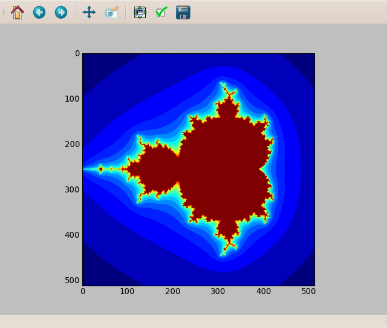
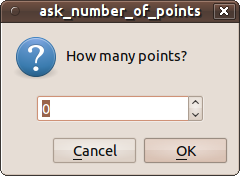
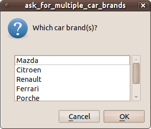
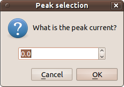
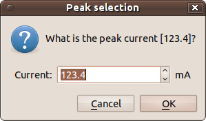
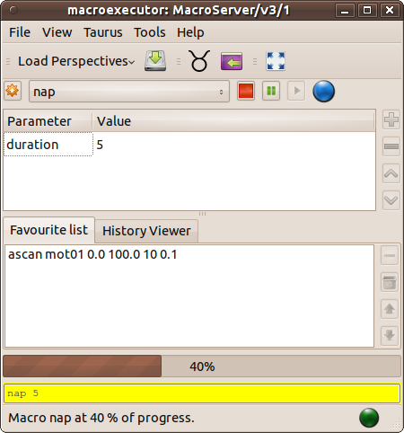

.. highlight:: python
   :linenothreshold: 5
   
.. currentmodule:: sardana.macroserver.macro

.. _sardana-macros-howto:

===============
Writing macros
===============

This chapter provides the necessary information to write macros in sardana. The
complete macro :term:`API` can be found :ref:`here <sardana-macro-api>`.

What is a macro
---------------

A macro in sardana describes a specific procedure that can be executed at any
time. Macros run inside the *sardana sandbox*. This simply means that each time
you run a macro, the system makes sure the necessary environment for it to run
safely is ready.

Macros can only be written in Python_. A macro can be a :term:`function` or a
:term:`class`. In order for a :term:`function` to be recognized as a macro, it
**must** be properly *labeled* as a macro (this is done with a special
:class:`macro` *decorator*. Details are explaind below). In the same way, for a
:term:`class` to be recognized as a macro, it must inherit from a
:class:`Macro` super-class. Macros are case sensitive. This means that
*helloworld* is a different macro than *HelloWorld*.

The choice between writing a macro :term:`function` or a macro :term:`class`
depends not only on the type of procedure you want to write, but also (and
probably, most importantly) on the type of programming you are most confortable
with.

If you are a scientist, and you have a programming background on a functional
language (like fortran, matlab, SPEC_), then you might prefer to write macro
functions. Computer scientists (young ones, specially), on the other hand,
often have a background on object oriented languages (Java, C++, C#) and feel
more confortable writing macro classes.

Classes tend to scale better with the size of a program or library. By writing
a macro class you can benefit from all advantages of object-oriented
programming. This means that, in theory:

    - it would reduce the amount of code you need to write
    - reduce the complexity of your code y by dividing it into small,
      reasonably independent and re-usable components, that talk to each other
      using only well-defined interfaces
    - Improvement of productivity by using easily adaptable pre-defined
      software components

In practice, however, and specially if you don't come from a programming
background, writing classes requires a different way of thinking. It will also
require you to extend your knowledge in terms of syntax of a programming
language.

Furthermore, most tasks you will probably need to execute as macros, often don't
fit the class paradigm that object-oriented languages offer. If you are
writing a sequencial procedure to run an experiment then you are probably
better of writing a python function which does the job plain and simple.

One reason to write a macro as a class is if, for example, you want to extend
the behaviour of the :class:`~sardana.macroserver.macros.standard.mv` macro. In
this case, probably you would want to *extend* the existing macro by writing
your own macro class which *inherits* from the original macro and this way
benefit from most of the functionallity already existing in the original macro.

What should and should not be a macro
-------------------------------------

The idea of a macro is simply a piece of Python_ code that can be executed from
control system interface (:term:`GUI`\/:term:`CLI`). Therefore, anything that
you don't need to be executed by the interface should **NOT** be a macro.

When you have a big library of functions and classes, the approach to expose
them to sardana should be to first carefully decide which procedures should be
invoked by a :term:`GUI`\/:term:`CLI` (namely the name of the procedure, which
parameters it should receive and if it returns any value). Then write the
macro(s) which invoke the code of the original library. Avoid the temptation to
convert the functions/classes of the original library into macros because:

  - This will most certainly break your code (any code that calls a function
    or class that has been converted to a macro will fail)
  - It will excessively polute the macro list (imagine a :term:`GUI` with a
    combo box to select which macro to execute. If you have hundreds of macros
    it will take forever to find the one to execute even if they are in
    alphabetical order)

How to start writing a macro
-----------------------------

Since macros are essencially Python_ code, they reside inside a Python_ file. In
sardana, we call a Python_ file which contains macros a *macro library*.

At the time of writing, the easiest way to create a new macro is from spock (we
are currently working on a macro editor :term:`GUI`). 

Preparing your text editor
~~~~~~~~~~~~~~~~~~~~~~~~~~

Before launching spock it is important to decide which text editor you will use
to write your macros. Unless configured otherwise, spock will use the editor
specified by the system environment variable :envvar:`EDITOR`. If this variable
is not set, it will default to vi under Linux/Unix and to notepad under
Windows. The following line explains how to set the :envvar:`EDITOR`
environment variable to gedit under linux using bash shell::

    $ export EDITOR=gedit

If you choose *gedit* it is important to properly configure it to write Python_
code:

    Go to :menuselection:`Edit --> Preferences --> Editor` and select:

        - *Tab width* : 4
        - *Insert spaces instead of tabs*
    
    .. image:: ../../_static/gedit_config.png

If you choose *kwrite* it is important to properly configure it to write Python_
code:

    Go to :menuselection:`Settings --> Configure editor...` and choose
    *Editing*:

        - In *General* tab:
            - *Tab width* : 4
            - *Insert spaces instead of tabulators*
        - In *Indentation* tab:
            - *Default indentation mode* : Python
            - *Indentation width* : 4
    
    .. image:: ../../_static/kwrite_config.png

Now you are ready to start writing your macro! Type *spock* on the command
line. Once you are in spock, you can use the
:class:`~sardana.macroserver.macros.expert.edmac` to create/edit macros. Let's
say you want to create a new macro called *hello_world* in a new macro library
called *salute*. Just type in:

.. sourcecode:: spock

    LAB-01-D01 [1]: edmac hello_world salute
    Opening salute.hello_world...
    Editing...
    
This will bring your favorite editor to life with a macro function template
code for the macro *hello_world*.

    .. image:: ../../_static/macro_edit.png

The next chapter will explain how to fill this template with useful code. After
you finish editing the macro, save the file, exit the editor and go back to
spock. You'll be asked if you want the new code to be load on the server. Just
answer 'y'.

.. sourcecode:: spock

    LAB-01-D01 [1]: edmac hello_world salute
    Openning salute.hello_world...
    Editing...
    Do you want to apply the new code on the server? [y] y
    
.. _macro_function_writing:

Writing a macro function
------------------------

As mentioned before, macros are just simple Python_ functions which have been
*labeled* as macros. In Python_, these labels are called *decorators*. Here is
the macro function version of *Hello, World!*::
    
    from sardana.macroserver.macro import macro
    
    @macro()
    def hello_world(self):
        """This is a hello world macro"""
        self.output("Hello, World!")

**line 1**
    imports the *macro* symbol from the sardana macro package.
    :mod:`sardana.macroserver.macro` is the package which contains most symbols
    you will require from sardana to write your macros.

**line 3**
    this line *decorates* de following function as a macro. It is
    **crucial** to use this decorator in order for your :term:`function` to be
    recognized by sardana as a valid macro.

**line 4**
    this line contains the hello_world :term:`function` definition. Every
    macro needs **at least** one parameter. The first parameter is the macro
    execution context. It is usually called ``self`` but you can name it
    anything. This parameter gives you access to the entire context where the
    macro is being run. Through it, you'll be able to do all sorts of things,
    from sending text to the output to ask for motors or even execute other
    macros.

**line 5**
    Documentation for this macro. You should **always** document your macro!

**line 6**
    this line will print *Hello, World!* on your screen.
    
.. note::
    If you already know a little about Python_ your are probably wondering why
    not use ``print "Hello, World!"``?

    Remember that your macro will be executed by a Sardana server which may be
    running in a different computer than the computer you are working on.
    Executing a *normal print* would just print the text in the server.
    Therefore you need to explicitly say you want the text on the computer you
    are working and not the server. The way to do it is using
    :meth:`~sardana.macroserver.macro.Macro.output` instead of print. 
    
    If you prefer, you can use the context version of Python_ :func:`print`
    function (it is a bit more powerful than 
    :meth:`~sardana.macroserver.macro.Macro.output`\, and has a slightly
    different syntax) ::

        # mandatory first line in your code if you use Python < 3.0
        from __future__ import print_function
        
        from sardana.macroserver.macro import macro
        
        @macro()
        def hello_world(self):
            """This is an hello world macro"""
            self.print("Hello, World!")

    The following footnote describes how to discover your Python_
    version [#f2]_.

Remeber that a macro is, for all purposes, a normal Python_ :term:`function`.
This means you **CAN** inside a macro write **ANY** valid Python_ code. This
includes :keyword:`for` and :keyword:`while` loops, :keyword:`if` ...
:keyword:`elif` ... :keyword:`else` conditional execution, etc... ::

        import numpy.fft
        
        @macro()
        def fft_my_wave(self):
            wave_device = self.getDevice("sys/tg_test/1")
            wave = wave_device.wave
            wave_fft = numpy.fft.fft(wave)
            

Adding parameters to your macro
-------------------------------

Standard Python_ allows you to specify parameters to a function by placing comma
separated parameter names between the ``()`` in the function definition. The
macro :term:`API`, in adition, enforces you to specify some extra parameter
information. At first, this may look like a useless complication, but you will
apreciate clear benefits soon enough. Here are some of them:

    - error prevention: a macro will not be allowed to run if the given
      parameter if of a wrong type
    - :term:`CLI`\s like Spock will be able to offer autocomplete
      facilities (press <tab> and list of allowed parameters show up)
    - :term:`GUI`\s can display list of allowed parameter values in combo
      boxes which gives increased usability and prevents errors
    - Documentation can be generated automatically

So, here is an example on how to define a macro that needs one parameter::

    @macro([["moveable", Type.Moveable, None, "moveable to get position"]])
    def where_moveable(self, moveable):
        """This macro prints the current moveable position"""
        self.output("%s is now at %s", moveable.getName(), moveable.getPosition())

Here is another example on how to define a macro that needs two parameters:

    - Moveable (motor, pseudo motor)
    - Float (motor absolute position to go to)

::

    from sardana.macroserver.macro import macro, Type

    @macro([ ["moveable", Type.Moveable, None, "moveable to move"],
             ["position", Type.Float, None, "absolute position"] ])
    def move(self, moveable, position):
        """This macro moves a moveable to the specified position"""
        moveable.move(position)
        self.output("%s is now at %s", moveable.getName(), moveable.getPosition())

The parameter information is a :obj:`list` of :obj:`list`\s. Each :obj:`list`
being a composed of four elements:

    - parameter name
    - parameter type
    - parameter default value (None means no default value)
    - parameter description
    
Here is a list of the most common allowed parameter types:

    - ``Integer``: an integer number
    - ``Float``: a real number
    - ``Boolean``: a boolean True or False
    - ``String``: a string
    - ``Moveable``: a moveable element (motor, pseudo-motor)
    - ``Motor``: a pure motor
    - ``ExpChannel``: an experimental channel (counter/timer, 0D,
      pseudo-counter, ...)
    - ``Controller``: a controller
    - ``ControllerClass``: an existing controller class plugin
    - ``MacroCode``: a macro
    - ``MeasurementGroup``: a measurement group
    - ``Any``: anything, really

The complete list of types distributed with sardana is made up by these five
simple types: ``Integer``, ``Float``, ``Boolean``, ``String``, ``Any``, plus
all available sardana interfaces (:obj:`~sardana.sardanadefs.Interface`)

.. _sardana-macro-context:

Macro context
-------------

One of the most powerfull features of macros is that the entire context of
sardana is at your disposal. Simply put, it means you have access to all
sardana elements by means of the first parameter on your macro (you can give
this parameter any name but usually, by convention it is called ``self``).

``self`` provides access to an extensive catalog of functions you can use in
your macro to do all kinds of things. The complete catalog of functions can be
found :ref:`here <sardana-macro-api>`.

Let's say you want to write a macro that explicitly moves a known *theta* motor
to a certain position. You could write a macro which receives the motor as
parameter but that would be a little silly since you already know beforehand
which motor you will move. Instead, a better solution would be to *ask* sardana
for a motor named "theta" and use it directly. Here is how you can acomplish
that::

    @macro([["position", Type.Float, None, "absolute position"]])
    def move_theta(self, position):
        """This macro moves theta to the specified position"""
        th = self.getMotor("th")
        th.move(position)
        self.output("Motor ended at %s", moveable.getPosition())

.. _sardana-macro-calling:

Calling other macros from inside your macro
-------------------------------------------

One of the functions of the macro decorator is to pass the *knowledge* of all
existing macros to your macro. This way, without any special imports, your
macro will *know* about all other macros on the system even if they have been
written in other files.

Lets recreate the two previous macros (*where_moveable* and *move*) to execute
two of the macros that exist in the standard macro catalog
(:class:`~sardana.macroserver.macros.standard.wm` and
:class:`~sardana.macroserver.macros.standard.mv`)

Here is the new version of *where_moveable* ::

    @macro([["moveable", Type.Moveable, None, "moveable to get position"]])
    def where_moveable(self, moveable):
        """This macro prints the current moveable position"""
        self.wm(moveable)

... and the new version of *move* ::

    @macro([ ["moveable", Type.Moveable, None, "moveable to move"],
             ["position", Type.Float, None, "absolute position"] ])
    def move(self, moveable, position):
        """This macro moves a moveable to the specified position"""
        self.mv(moveable, position)
        self.output("%s is now at %s", moveable.getName(), moveable.getPosition())

.. _sardana-macro-environment:

Accessing environment
---------------------

The sardana server provides a global space to store variables, called
*environment*. The *environment* is a :term:`dictionary` storing a value for
each variable. This *environment* is stored persistently so if the sardana
server is restarted the environment is properly restored.

Variables are case sensitive.

The value of an existing environment variable can be accessed using
:meth:`~Macro.getEnv`. Setting the value of an environment variable is done
with :meth:`~Macro.setEnv`.

For example, we know the ascan macro increments a ``ScanID`` environment
variable each time it is executed. The following example executes a scan and
outputs the new ``ScanID`` value:

.. code-block:: python
    :emphasize-lines: 7
    
    @macro([["moveable", Type.Moveable, None, "moveable to get position"]])
    def fixed_ascan(self, moveable):
        """This does an ascan starting at 0 ending at 100, in 10 intervals
        with integration time of 0.1s"""
        
        self.ascan(moveable, 0, 100, 10, 0.1)
        scan_id = self.getEnv('ScanID')
        self.output("ScanID is now %d", scan_id)

.. _sardana-macro-logging:

Logging
-------

The Macro :term:`API` includes a set of methods that allow you to write log
messages with different levels:

.. hlist::
    :columns: 4
    
    * :meth:`~Macro.debug`
    * :meth:`~Macro.info`
    * :meth:`~Macro.warning`
    * :meth:`~Macro.error`
    * :meth:`~Macro.critical`
    * :meth:`~Macro.log`
    * :meth:`~Macro.output`
    
As you've seen, the special :meth:`~Macro.output` function has the same effect
as a print statement (with slightly different arguments).

Log messages may have several destinations depending on how your sardana server
is configured. At least, one destination of each log message is the client(s)
(spock, GUI, other) which are connected to the server. Spock, for example,
handles the log messages by printing to the console with different colours. By
default, spock prints all log messages with level bigger than
:meth:`~Macro.debug` (You can change this behaviour by typing ``debug on`` in
spock). Another typical destination for log messages is a log file.

Here is an example on how to write a logging information message::

    @macro()
    def lets_log(self):
        self.info("Starting to execute %s", self.getName())
        self.output("Hello, World!")
        self.info("Finished to executing %s", self.getName())

.. KEEP COMMENTED WHILE CHAPTER IS NOT WRITTEN
.. .. seealso::

..    :ref:`log configuration <sardana-macroserver-configuration-log>`
..        The sardana log configuration.
..

.. _sardana-macro-reporting:

Reports
-------

Once the report facility has been properly configured, report messages can be
sent to the previously configured report file.

There are several differences between :ref:`reporting <sardana-macro-reporting>` and
:ref:`logging <sardana-macro-logging>`. The first difference is that log messages may
or may not be recorded, depending on the configured filters on the target
(example: log file). A report will always be recorded.

Another difference is that report messages are not sent to the clients. The idea
of a report is to silently record in a file that something as happened.

A third difference is that unlike logs, reports have no message level associated
to them (actually since internally the log library is used to report messages,
every report record as the predefined level *INFO* but this is just an
implementation detail).

A report message can be emited at any time in the macro using the
:meth:`~Macro.report` method:

.. code-block:: python
    :emphasize-lines: 3
    
    @macro()
    def lets_report(self):
        self.report("this is an official report of macro '%s'", self.getName())

This would generate the following report message in the report file:

    INFO     2012-07-18 09:39:34,943: this is an official report of macro 'lets_report'

.. KEEP COMMENTED WHILE CHAPTER IS NOT WRITTEN
.. .. seealso::

..    :ref:`Report configuration <sardana-macroserver-configuration-report>`
..        The sardana report configuration.

.. _sardana-advanced-macro-calling:

Advanced macro calls
--------------------

As previously explained (see :ref:`calling macros <sardana-macro-calling>`), you can use
the Macro :term:`API` to call other macros from inside your own macro:

.. code-block:: python
    :emphasize-lines: 5
    
    @macro([["moveable", Type.Moveable, None, "moveable to get position"]])
    def fixed_ascan(self, moveable):
        """This does an ascan starting at 0 ending at 100, in 10 intervals
        with integration time of 0.1s"""
        self.ascan(moveable, 0, 100, 10, 0.1)

An explicit call to :meth:`~Macro.execMacro` would have the same effect:

.. code-block:: python
    :emphasize-lines: 5
    
    @macro([["moveable", Type.Moveable, None, "moveable to get position"]])
    def fixed_ascan(self, moveable):
        """This does an ascan starting at 0 ending at 100, in 10 intervals
        with integration time of 0.1s"""
        self.execMacro('ascan', moveable, '0', '100', '10', '0.2')
    
The advantage of using :meth:`~Macro.execMacro` is that it supports passing
parameters with different *flavors*:
    
    * parameters as strings::

        self.execMacro('ascan', motor.getName(), '0', '100', '10', '0.2')
        
    * parameters as space separated string::
        
        self.execMacro('ascan %s 0 100 10 0.2' % motor.getName())

    * parameters as concrete types::
    
        self.execMacro(['ascan', motor, 0, 100, 10, 0.2])
        
Sometimes it is desirable to access data generated by the macro we just called.
For these cases, the Macro :term:`API` provides a pair of low level methods
:meth:`~Macro.createMacro` and :meth:`~Macro.runMacro` together with
:meth:`~Macro.data`.

Let's say that you need access to the data generated by an ascan. First you call
:meth:`~Macro.createMacro` with the same parameter you would give to
:meth:`~Macro.execMacro`. This will return a tuple composed from a macro object 
and the result of the :meth:`~Macro.prepare` method. Afterward you call :meth:`~Macro.runMacro` giving 
as parameter the macro object returned by :meth:`~Macro.createMacro`. 
In the end, you can access the data generated by the macro 
using :meth:`~Macro.data`:

.. code-block:: python
    :emphasize-lines: 6,7,8

    @macro([["moveable", Type.Moveable, None, "moveable to get position"]])
    def fixed_ascan(self, moveable):
        """This does an ascan starting at 0 ending at 100, in 10 intervals
        with integration time of 0.1s"""
        
        my_scan = self.createMacro('ascan', moveable, '0', '100', '10', '0.2')
        self.runMacro(my_scan)
        print len(my_scan.data)

A set of macro call examples can be found
:ref:`here <sardana-devel-macro-call-examples>`.

.. _sardana-macro-class-writing:

Writing a macro class
----------------------

This chapter describes an advanced alternative to writing macros as Python_
classes. If words like *inheritance*, *polimorphism* sound like a lawyer's
horror movie then you probably should only read this if someone expert in
sardana already told you that the task you intend to do cannot be accomplished
by writing macro functions.

The simplest macro class that you can write **MUST** obey the following rules:

    * Inherit from :class:`Macro`
    * Implement the :meth:`~Macro.run` method

The :meth:`~Macro.run` method is the place where you write the code of your
macro. So, without further delay, here is the *Hello, World!* example::

    from sardana.macroserver.macro import Macro
    
    class HelloWorld(Macro):
        """Hello, World! macro"""
        
        def run(self):
            print "Hello, World!"

.. _sardana-macro-add-parameters:

Let's say you want to pass an integer parameter to your macro. All you have to
do is declare the parameter by using the :attr:`~Macro.param_def` Macro member::

    from sardana.macroserver.macro import Macro, Type
    
    class twice(Macro):
        """Macro twice. Prints the double of the given value"""

        param_def = [ [ "value", Type.Float, None, "value to be doubled" ] ]
            
        def run(self, value):
            self.output(2*value)

.. note::
    As soon as you add a :attr:`~Macro.param_def` you also need to
    modify the :meth:`~Macro.run` method to support the new paramter(s).

A set of macro parameter examples can be found
:ref:`here <sardana-devel-macro-parameter-examples>`.

.. _sardana-macro-preparing:

Preparing your macro for execution
~~~~~~~~~~~~~~~~~~~~~~~~~~~~~~~~~~

Additionaly to the :meth:`~Macro.run` method, you may write a
:meth:`~Macro.prepare` method where you may put code to prepare the macro for
execution (for example, checking pre-conditions for running the macro). By
default, the prepare method is an empty method. Here is an example on how to
prepare HelloWorld to run only after year 1989:

.. code-block:: python
    :emphasize-lines: 7
    
    import datetime
    from sardana.macroserver.macro import Macro

    class HelloWorld(Macro):
        """Hello, World! macro"""
        
        def prepare(self):
            if datetime.datetime.now() < datetime.datetime(1990,01,01):
                raise Exception("HelloWorld can only run after year 1989")
    
        def run(self):
            print "Hello, World!"

.. _sardana-macro-plotting:

Plotting
--------

Remember that your macro will be executed by a Sardana server which may be
running in a different computer than the computer you are working on. Executing
a normal plot (from :mod:`matplotlib` or :mod:`guiqwt`) would just try to show
a plot in the server machine. The macro :term:`API` provides a way to plot
graphics from inside your macro whenver the client that runs the macro
*understands* the plot request (don't worry, spock does understand!)

The plotting :term:`API` is the same used by :mod:`~matplotlib.pyplot`. The
:term:`API` is accessible through the macro context (``self``). Here is an
example::

    import math
    from numpy import linspace
    from scipy.integrate import quad
    from scipy.special import j0

    from sardana.macroserver.macro import macro

    def j0i(x):
        """Integral form of J_0(x)"""
        def integrand(phi):
            return math.cos(x * math.sin(phi))
        return (1.0/math.pi) * quad(integrand, 0, math.pi)[0]

    @macro()
    def J0_plot(self):
        """Sample J0 at linspace(0, 20, 200)"""
        x = linspace(0, 20, 200)
        y = j0(x)
        x1 = x[::10]
        y1 = map(j0i, x1)
        self.pyplot.plot(x, y, label=r'$J_0(x)$') # 
        self.pyplot.plot(x1, y1, 'ro', label=r'$J_0^{integ}(x)$')
        self.pyplot.title(r'Verify $J_0(x)=\frac{1}{\pi}\int_0^{\pi}\cos(x \sin\phi)\,d\phi$')
        self.pyplot.xlabel('$x$')
        self.pyplot.legend()

Running this macro from spock will result in something like:

    .. image:: ../../_static/macro_plotting1.png

Just for fun, the following macro computes a fractal and plots it as an image::

    import numpy

    @macro([["interactions", Type.Integer, None, ""],
            ["density", Type.Integer, None, ""]])
    def mandelbrot(self, interactions, density):

        x_min, x_max = -2, 1
        y_min, y_max = -1.5, 1.5
        
        x, y = numpy.meshgrid(numpy.linspace(x_min, x_max, density),
                              numpy.linspace(y_min, y_max, density))
                             
        c = x + 1j * y
        z = c.copy()
        
        fractal = numpy.zeros(z.shape, dtype=numpy.uint8) + 255
        
        finteractions = float(interactions)
        for n in range(interactions):
            z *= z
            z += c
            mask = (fractal == 255) & (abs(z) > 10)
            fractal[mask] = 254 * n / finteractions
        self.pyplot.imshow(fractal)

And the resulting image (interactions=20, density=512):

    

A set of macro plotting examples can be found
:ref:`here <sardana-devel-macro-plotting-examples>`.

Known plotting limitations
~~~~~~~~~~~~~~~~~~~~~~~~~~

When you plot from inside a macro with ``self.pyplot.plot``, the sardana server
will "ask" spock to execute the desired function with the given parameters.
This means that the result of plotting (a sequence of
:class:`~matplotlib.line.Line2D`) is not available in the sardana server (since
the actual line is in spock). The result of any function call in
``self.pyplot`` will always be None!

This means that the following code which works in a normal IPython_ console will
**NOT** work inside a macro:

.. sourcecode:: spock

    LAB-01-D01 [1]: line = plot(range(10))[0]

    LAB-01-D01 [2]: line.set_linewidth(5)

Also consider that each time you plot the complete data to be plotted is sent
from the server to the client... so please avoid plotting arrays of 10,000,000
points!

.. _sardana-macro-input:

Asking for user input
---------------------

It is possible to ask for user input inside a macro.

.. hint::
    Asking for input in the middle of long macros will cause the macro to 
    stop and wait for user input. If you write a long macro that might be
    executed *in the middle of the night* please take the appropriate steps
    to make sure you don't arrive in the morning and you are faced with 
    a message box waiting for you to answer a question that could be avoided
    with a proper *default value*. To make sure your macro can run in
    *unattended* mode make sure that:
    
      - it implements the interactive *interface*
      - every :meth:`~Macro.input` gives a *default_value* 
        :term:`keyword argument <keyword argument>`
      
    (read on to see how to meet these requirements)

In pure Python_, to ask for user input you can use the :func:`raw_input` (Python
2) / :func:`input` (Python 3) ::

    >>> answer = raw_input('--> ')
    --> Monty Python's Flying Circus
    >>> answer
    "Monty Python's Flying Circus"

The Macro :term:`API` provides a much more powerful version of
:meth:`~Macro.input` since it can accept a wide variaty of options.

Similar to what happens with :ref:`sardana-macro-plotting`, when input is requested from
inside a macro, the question will be sent to the client (example: spock) which
ordered the macro to be executed. At this time the macro is stopped waiting for
the client to answer. The client must "ask" the user for a proper value and the
answer is sent back to the server which then resumes the macro execution.

Asking for user input is straightforward:

.. code-block:: python
    :emphasize-lines: 5

    @macro()
    def ask_name(self):
        """Macro function version to ask for user name"""

        answer = self.input("What's your name?")
        self.output("So, your name is '%s'", answer)
    
Executing this macro will make spock popup an Input Dialog Box like this one:

    .. image:: ../../_static/macro_input.png

When you type your name and press :guilabel:`&OK` the macro finishes printing
the output:

.. sourcecode:: spock

    LAB-01-D01 [1]: ask_name
    <warning>Non interactive macro 'ask_name' is asking for input (please set this macro interactive to True)
    So, your name is 'Homer Simpson'
 
The macro prints a warning message saying that the macro was not declared as
*interactive*. All macros that request user input **should** be declared as
interactive. This is because the sardana server can run a macro in *unattended*
mode. When an interactive macro is run in *unattended* mode, all
:meth:`~Macro.input` instructions that have a default value will return
automatically the default value without asking the user for input.

To declare a macro as interactive set the ``interactive``
:term:`keyword argument <keyword argument>` in the macro decorator to ``True``
(default value for ``interactive`` is ``False``), like this:

.. code-block:: python
    :emphasize-lines: 1

    @macro(interactive=True)
    def ask_name(self):
        """Macro function version to ask for user name"""
        
        answer = self.input("What's your name?")
        self.output("So, your name is '%s'", answer)

To declare a macro class as interactive set the ``interactive`` member to
``True`` (default value for ``interactive`` is ``False``), like this:

.. code-block:: python
    :emphasize-lines: 4
    
    class ask_name(Macro):
        """Macro class version to ask for user name"""
        
        interactive = True
        
        def run(self):
            answer = self.input("What's your name?")
            self.output("So, your name is '%s'", answer)

a helper :class:`~imacro` decorator and a :class:`iMacro` class exist which can
be used instead of the :class:`macro` decorator and :class:`Macro` class to
transparently declare your macro as interactive:

.. code-block:: python
    :emphasize-lines: 1,5,14
    
    from sardana.macroserver.macro import imacro, iMacro
    
    # interactive macro function version
    
    @imacro()
    def ask_name(self):
        """Macro function version to ask for user name"""
        
        answer = self.input("What's your name?")
        self.output("So, your name is '%s'", answer)

    # interactive macro class version

    class ask_name(iMacro):
        """Macro class version to ask for user name"""
        
        def run(self):
            answer = self.input("What's your name?")
            self.output("So, your name is '%s'", answer)

The following sub-chapters explain the different options available for macro
user input.

Specifying input data type
~~~~~~~~~~~~~~~~~~~~~~~~~~

The default return type of :class:`~Macro.input` is :obj:`str` which mimics the
pure Python_ input function. However, often you want to restrict the user input
to a specific data type like ``Integer``, ``Float`` or even complex object like
``Moveable`` or to a list of possible options.

The macro :class:`~Macro.input` :term:`API` provides an easy way to do this by
specifying the concrete data type in the
:term:`keyword argument <keyword argument>` *data_type*. The following examples
shows how to ask for an ``Integer``, a ``Moveable``, and single/multiple
selection from a list of options::

    from sardana.macroserver.macro import imacro, Type

    @imacro()
    def ask_number_of_points(self):
        """asks user for the number of points"""
        
        nb_points = self.input("How many points?", data_type=Type.Integer)
        self.output("You selected %d points", nb_points)

    @imacro()
    def ask_for_moveable(self):
        """asks user for a motor"""
        
        moveable = self.input("Which moveable?", data_type=Type.Moveable)
        self.output("You selected %s which is at %f", moveable, moveable.getPosition())

    @imacro()
    def ask_for_car_brand(self):
        """asks user for a car brand"""
        
        car_brands = "Mazda", "Citroen", "Renault"
        car_brand = self.input("Which car brand?", data_type=car_brands)
        self.output("You selected %s", car_brand)

    @imacro()
    def ask_for_multiple_car_brands(self):
        """asks user for several car brands"""
        
        car_brands = "Mazda", "Citroen", "Renault", "Ferrari", "Porche", "Skoda"
        car_brands = self.input("Which car brand(s)?", data_type=car_brands,
                                allow_multiple=True)
        self.output("You selected %s", ", ".join(car_brands))

... and these are the corresponding dialogs that will popup in spock:

    |input_integer| |input_moveable| |input_select_radio|
    |input_select_multiple|

Providing a default value
~~~~~~~~~~~~~~~~~~~~~~~~~

Providing a default value is **very important** since it will allow your macro
to run in *unattended* mode. When given, the *default_value*
:term:`keyword argument <keyword argument>` value type must be compatible with
the *data_type* :term:`keyword argument <keyword argument>`. Providing a
default value is easy. The following examples repeat the previous data type
examples giving compatible default values::

    from sardana.macroserver.macro import imacro, Type

    @imacro()
    def ask_number_of_points(self):
        """asks user for the number of points"""
        
        nb_points = self.input("How many points?", data_type=Type.Integer,
                               default_value=100)
        self.output("You selected %d points", nb_points)

    @imacro()
    def ask_for_moveable(self):
        """asks user for a motor"""
        
        moveable = self.input("Which moveable?", data_type=Type.Moveable,
                              default_value="gap01")
        self.output("You selected %s which is at %f", moveable, moveable.getPosition())

    @imacro()
    def ask_for_car_brand(self):
        """asks user for a car brand"""
        
        car_brands = "Mazda", "Citroen", "Renault"
        car_brand = self.input("Which car brand?", data_type=car_brands,
                               default_value=car_brands[1])
        self.output("You selected %s", car_brand)

    @imacro()
    def ask_for_multiple_car_brands(self):
        """asks user for several car brands. Default is every other car brand
        in the list"""
        
        car_brands = "Mazda", "Citroen", "Renault", "Ferrari", "Porche", "Skoda"
        car_brands = self.input("Which car brand(s)?", data_type=car_brands,
                                allow_multiple=True,
                                default_value=car_brands[::2])
        self.output("You selected %s", ", ".join(car_brands))

Giving a title
~~~~~~~~~~~~~~

By default, the Dialog window title will contain the name of the macro which
triggered user input. You can override the default behaviour with the
:term:`keyword argument <keyword argument>` *title*::

    @imacro()
    def ask_peak(self):
        """asks use for peak current of points with a custom title"""
        
        peak = self.input("What is the peak current?", data_type=Type.Float,
                          title="Peak selection")
        self.output("You selected a peak of %f A", peak)

... and this is the corresponding dialog:

    |input_float_title|

Specifying label and unit
~~~~~~~~~~~~~~~~~~~~~~~~~

The *key* and *unit* :term:`keyword arguments <keyword argument>` can be used to
provide additional label and unit information respectively and prevent user
mistakes::

    @imacro()
    def ask_peak_v2(self):
        """asks use for peak current of points with a custom title,
        default value, label and units"""
        
        label, unit = "peak", "mA"
        peak = self.input("What is the peak current?", data_type=Type.Float,
                          title="Peak selection", key=label, unit=unit,
                          default_value=123.4)
        self.output("You selected a %s of %f %s", label, peak, unit)

... and this is the corresponding dialog:

    |input_float_title_label_unit|

Limiting ranges, setting decimal places and step size
~~~~~~~~~~~~~~~~~~~~~~~~~~~~~~~~~~~~~~~~~~~~~~~~~~~~~

When numeric input is requested, it might be useful to prevent user input
outside a certain range. This can be achieved with the *minimum* and *maximum*
:term:`keyword arguments <keyword argument>`::

    @imacro()
    def ask_peak_v3(self):
        """asks use for peak current of points with a custom title,
        default value, label, units and ranges"""
        
        label, unit = "peak", "mA"
        peak = self.input("What is the peak current?", data_type=Type.Float,
                          title="Peak selection", key=label, unit=unit,
                          default_value=123.4, minimum=0.0, maximum=200.0)
        self.output("You selected a %s of %f %s", label, peak, unit)

An additional *step* :term:`keyword argument <keyword argument>` may help
increase usability by setting the step size in a input spin box::

    @imacro()
    def ask_peak_v4(self):
        """asks use for peak current of points with a custom title,
        default value, label, units, ranges and step size"""
        
        label, unit = "peak", "mA"
        peak = self.input("What is the peak current?", data_type=Type.Float,
                          title="Peak selection", key=label, unit=unit,
                          default_value=123.4, minimum=0.0, maximum=200.0,
                          step=5)
        self.output("You selected a %s of %f %s", label, peak, unit)

When asking for a decimal number, it might be useful to use the *decimals*
:term:`keyword argument <keyword argument>` to indicate how many decimal places
to show in a input spin box::

    @imacro()
    def ask_peak_v5(self):
        """asks use for peak current of points with a custom title,
        default value, label, units, ranges, step size and decimal places"""
        
        label, unit = "peak", "mA"
        peak = self.input("What is the peak current?", data_type=Type.Float,
                          title="Peak selection", key=label, unit=unit,
                          default_value=123.4, minimum=0.0, maximum=200.0,
                          step=5, decimals=2)
        self.output("You selected a %s of %f %s", label, peak, unit)

A set of macro input examples can be found
:ref:`here <sardana-devel-macro-input-examples>`.

Showing progress in long macros
-------------------------------

Some of the macros you write may take a long time to execute. It could be useful
to provide frequent feedback on the current progress of your macro to prevent
users from thinking the system is blocked. The way to do this is by
:keyword:`yield`\ing a new progress number in the ode everytime you want to
send a progress.

The following code shows an example:

.. code-block:: python
    :emphasize-lines: 9

    import time

    @macro([["duration", Type.Integer, 1, "time to sleep (s)"]])
    def nap(self, duration):
        
        fduration = float(duration)
        for i in range(duration):
            time.sleep(1)
            yield (i+1) / fduration * 100

The important code here is line 9. Everytime the macro execution reaches this
line of code, basically it tells sardana to send a progress with the desired
value. By default, the value is interpreted has a percentage and should have
the range between 0.0 and 100.0. 

Actually, even if your macro doesn't explicitly send macro progress reports,
sardana always generates a 0.0 progress at the beginning of the macro and a
last 100.0 progress at the end so for example, in a :term:`GUI`, the progress
bar showing the macro progress will always reach the end (unless an error
occurs) no matter how you program the progress.

|macro_progress|

It is possible to generate a progress that doesn't fit the 0 - 100.0 range. The
above macro has been modified to send a progress with a customized range:

.. code-block:: python
    :emphasize-lines: 6, 11, 12

    import time

    @macro([["duration", Type.Integer, 1, "time to sleep (s)"]])
    def nap(self, duration):

        status = { 'range' : [0, duration] }        
                
        fduration = float(duration)
        for i in range(duration):
            time.sleep(1)
            status['step'] = i+1
            yield status

You may notice that this way, the range can be changed dynamically. A progress
bar in a :term:`GUI` is programmed to adjust not only the current progress
value but also the ranges so it is safe to change them if necessary.

.. rubric:: Footnotes

.. [#f1] To find the absolute path for sardana's source code type on the
         command line ``python -c "import sys, sardana; sys.stdout.write(str(sardana.__path__))"``

.. [#f2] To check which version of Python_ you are using type on the command
         line ``python -c "import sys; sys.stdout.write(sys.version)"``

.. |input_moveable| image:: ../../_static/macro_input_moveable.png
    :align: middle

.. _ALBA: http://www.cells.es/
.. _ANKA: http://http://ankaweb.fzk.de/
.. _ELETTRA: http://http://www.elettra.trieste.it/
.. _ESRF: http://www.esrf.eu/
.. _FRMII: http://www.frm2.tum.de/en/index.html
.. _HASYLAB: http://hasylab.desy.de/
.. _MAX-lab: http://www.maxlab.lu.se/maxlab/max4/index.html
.. _SOLEIL: http://www.synchrotron-soleil.fr/

.. _Tango: http://www.tango-controls.org/
.. _PyTango: http://packages.python.org/PyTango/
.. _Taurus: http://packages.python.org/taurus/
.. _QTango: http://www.tango-controls.org/download/index_html#qtango3
.. _Qt: http://qt.nokia.com/products/
.. _PyQt: http://www.riverbankcomputing.co.uk/software/pyqt/
.. _PyQwt: http://pyqwt.sourceforge.net/
.. _Python: http://www.python.org/
.. _IPython: http://ipython.org/
.. _ATK: http://www.tango-controls.org/Documents/gui/atk/tango-application-toolkit
.. _Qub: http://www.blissgarden.org/projects/qub/
.. _numpy: http://numpy.scipy.org/
.. _SPEC: http://www.certif.com/
.. _EPICS: http://www.aps.anl.gov/epics/
