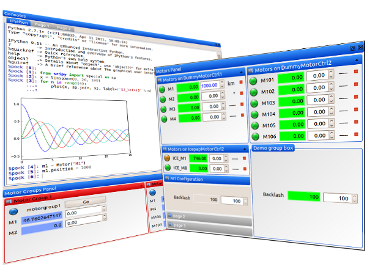
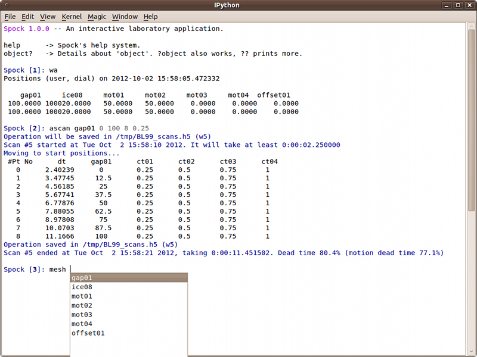

Sardana Home Page
=================

    |image1| |image2|

Sardana is a software suite for Supervision, Control and Data Acquisition
in scientific installations. It aims to reduce cost and time of design, 
development and support of the control and data acquisition systems. 
Sardana development was started at the ALBA_ synchrotron and today is 
supported by a larger community which includes several other laboratories 
and individuals (ALBA_, DESY_, MaxIV_, Solaris_, ESRF_).

You can download Sardana from PyPi_, check its Documentation_ or get support 
from its community and the latest code from the 
`project page <http://sourceforge.net/projects/sardana>`_.

Projects related to Sardana
---------------------------

- Sardana uses Taurus_ for control system access and user interfaces
- Sardana is based on Tango_
- The command line interface for Sardana (Spock) is based on IPython_

.. toctree::
    :hidden:

    Home Page <http://sardana-controls.org>
    Project Page <http://sourceforge.net/projects/sardana>
    Download from PyPI <http://pypi.python.org/pypi/sardana>
    docs

.. _ALBA: http://www.albasynchrotron.es
.. _DESY: http://www.desy.de
.. _MaxIV: http://www.maxiv.se/
.. _Solaris: http://www.synchrotron.uj.edu.pl/en_GB/
.. _ESRF: http://esrf.eu
.. _LGPL: http://www.gnu.org/licenses/lgpl.html
.. _PyPi: http://pypi.python.org/pypi/sardana 
.. _Documentation: http://sardana.readthedocs.org
.. _Tango: http://www.tango-controls.org/
.. _Taurus: http://taurus-scada.org/
.. _IPython: http://ipython.org/

:Last Update: |today|
