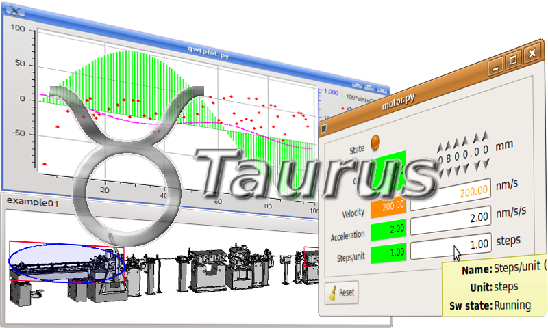

.. toctree::
    :hidden:
    :titlesonly:
    :maxdepth: 4

    Home Page <http://www.taurus-scada.org>
    Project Page <https://github.com/taurus-org/taurus>
    Download from PyPI <http://pypi.python.org/pypi/taurus>
    docs
    other_versions

Welcome to Taurus Home Page!
=============================================

    |image1| 

Taurus is a python framework for control and data acquisition CLIs and GUIs
in scientific/industrial environments.
It supports multiple control systems or data sources: Tango_, EPICS_, ...
New control system libraries can be integrated through plugins.

For non-programmers: Taurus allows the creation of fully-featured GUI (with 
forms, plots, synoptics, etc) from scratch in a few minutes using a "wizard",
which can also be customized and expanded by drag-and-dropping elements 
around at execution time.

For programmers: Taurus gives full control to more advanced users to create 
and customize CLIs and GUIs programmatically using Python and a very simple 
and economical API which abstracts data sources as "models".

Of course, Taurus is Free Software (under LGPL). You can download it from PyPi_,
access its Documentation_ or get support from its community and the latest code
from the `project page <https://github.com/taurus-org/taurus>`_.

See also the related Sardana_ project, which uses Taurus to build its user
interfaces.

:Last Update: |today|
:Release: |release|

.. _Tango: http://www.tango-controls.org/
.. _EPICS: http://www.aps.anl.gov/epics/
.. _PyQt: http://www.riverbankcomputing.co.uk/software/pyqt/
.. _Sardana: http://sardana-controls.org
.. _LGPL: http://www.gnu.org/licenses/lgpl.html
.. _PyPi: http://pypi.python.org/pypi/taurus 
.. _Documentation: http://taurus-scada.org/docs.html

