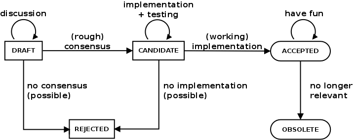

    Title: Introducing Taurus Enhancement Proposals (TEPs)
    TEP: 0
    State: OBSOLETE
    Reason: 
     TEP16 obsoletes TEP0. https://sourceforge.net/p/tauruslib/wiki/TEP is no 
     longer the index for TEPs, nor it is a wiki. The "Creating a TEP section" of 
     TEP0 is superseded by the one with the same name in TEP16.
    Date: 2016-04-07
    Drivers: Carlos Pascual-Izarra <cpascual@cells.es>, Tiago Coutinho <coutinho@esrf.fr>
    URL: http://www.taurus-scada.org/tep/?TEP0.md
    License: http://www.jclark.com/xml/copying.txt
    Abstract:
     Workflow for managing discussions about improvements to Taurus
     and archiving their outcomes.

Introduction
------------

*This TEP is an adaptation of [SEP0](https://sourceforge.net/p/sardana/wiki/SEP0)*

This is a proposal to organize discussions about Taurus enhancements, reflect
their current status and, in particular, to archive their outcomes, via a new
lightweight process based on Taurus Enhancement Proposals (TEPs). This idea is
a copy of the Sardana Enhancement Proposal system which is itself a copy of the
Debian Enhancement Proposal system with a few adjustments to the Taurus project
reality.

Motivation
----------

The main reason for using TEPs is to provide a central index in which to list
such proposals, which would be useful to see at a glance what open fronts
there are at a given moment in Taurus, and who is taking care of them and, 
additionally, to serve as a storage place for successfully completed proposals,
documenting the outcome of the discussion and the details of the implementation.

Workflow
--------

A "Taurus enhancement" can be pretty much any change to Taurus, technical or 
otherwise. Examples of situations when the TEP process might be or might have
been used include:

* Introducing a new feature in Taurus (e.g. Visualization widgets)
* Introducing/modifying a policy or workflow for the community

The workflow is very simple, and is intended to be quite lightweight: an
enhancement to Taurus is suggested, discussed, implemented, and becomes
accepted practice (or policy, if applicable), in the normal Taurus way. As the
discussion progresses, the enhancement is assigned certain states, as explained
 below. During all the process, a single URL maintained by the proposers can be
used to check the status of the proposal.

The result of all this is:

  1. an implementation of the enhancement and
  2. a document that can be referred to later on without having to dig
     up and read through large discussions.

The actual discussions should happen in the taurus mailing lists (normally 
taurus-devel, unless the discussion may benefit from getting input from the 
wider audience of taurus-users). This way, TEPs do not act asyet another forum
to be followed.

In the same way, TEPs do not give any extra powers or authority to anyone: they
rely on reaching consensus, by engaging in discussions on mailing lists, IRC,
or real life meetings as appropriate. In case of dispute, the ultimate decision
lies in the Taurus Executive Committee defined in the Taurus MoU.

The person or people who do the suggestion are the "drivers" of the proposal
and have the responsibility of writing the initial draft, and of updating it 
during the discussions, see below.

Proposal states
---------------

A given TEP can be in one of the following *states*:

* DRAFT
* CANDIDATE
* ACCEPTED
* REJECTED
* OBSOLETE

The ideal progression of states is DRAFT -> CANDIDATE -> ACCEPTED, but
reality requires a couple of other states and transitions as well.

### DRAFT state: discussion

* every new proposal starts as a DRAFT
* anyone can propose a draft
* each draft has a number (next free one from document index)
* normal discussion and changes to the text happen in this state
* drafts should include *extra* criteria for success (in addition to
  having obtained consensus, see below), that is, requirements to
  finally become ACCEPTED

#### DRAFT -> CANDIDATE: rough consensus

In order for a TEP to become CANDIDATE, the following condition should
be met:

* consensus exists for *what* should be done, and *how* it should be
  done (agreement needs to be expressed by all affected parties, not
  just the drivers; silence is not agreement, but unanimity is not
  required, either)

### CANDIDATE: implementation + testing

The CANDIDATE state is meant to prove, via a suitable implementation
and its testing, that a given TEP is feasible.

* of course, implementation can start in earlier states
* changes to the text can happen also in this period, primarily based
  on feedback from implementation
* this period must be long enough that there is consensus that the
  enhancement works (on the basis of implementation evaluation)
* since TEP are not necessarily technical, "implementation" does not
  necessarily mean coding

#### CANDIDATE -> ACCEPTED: working implementation

In order for a TEP to become ACCEPTED, the following condition should
be met:

* consensus exists that the implementation has been a success

### ACCEPTED: have fun

Once accepted:

* the final version of the TEP text is archived on the Taurus wiki
* if applicable, the proposed TEP change is integrated into
  authoritative texts such as policy, developer's reference, etc.

#### {DRAFT, CANDIDATE} -> REJECTED

A TEP can become REJECTED in the following cases:

* the drivers are no longer interested in pursuing the TEP and
  explicitly acknowledge so
* there are no modifications to a TEP in DRAFT state for 6 months or
  more
* there is no consensus either on the draft text or on the fact that
  the implementation is working satisfactorily

#### ACCEPTED -> OBSOLETE: no longer relevant

A TEP can become OBSOLETE when it is no longer relevant, for example:

* a new TEP gets accepted overriding previous TEPs (in that case the
  new TEP should refer to the one it OBSOLETE-s)
* the object of the enhancement is no longer in use

### {REJECTED, OBSOLETE}

In one of these states, no further actions are needed.

It is recommended that TEPs in one of these states carry a reason
describing why they have moved to such a state.

What the drivers should do
--------------------------

The only additional burden of the TEP process falls on the shoulders of its
drivers. They have to take care of all the practical work of writing
and maintaining the text, so that everyone else can just continue
discussing things as before.  Driver's burden can be summarized as:

* Write the draft text and update it during discussion.
* Determine when (rough) consensus in discussion has been reached.
* Implement, or find volunteers to implement.
* Determine when consensus of implementation success has been reached,
  when the testing of the available implementation has been satisfactory.
* Update the TEP with progress updates at suitable intervals, until the
  TEP has been accepted (or rejected).

If the drivers go missing in action, other people may step in and
courteously take over the driving position.

**Note**: the drivers can of course participate in the discussion as
everybody else, but have no special authority to impose their ideas to
others. <q>TEP gives pencils, not hammers.</q>

Format and content
------------------

A TEP is basically a free-form plain text file, except that it must
start with a paragraph of the following RFC822-style headers:

* Title: the full title of the document
* TEP: the number for this TEP
* State: the current state of this revision
* Date: the date of this revision
* Drivers: a list of drivers (names and e-mail addresses), in RFC822
  syntax for the To: header
* URL: during DRAFT state, a link to the wiki place of the draft
  (typically probably https://sourceforge.net/p/tauruslib/wiki/TEPxxx)
* Abstract: a short paragraph describing the TEP

(Additionally, REJECTED TEPs can carry a "Reason:" field describing
why they were rejected.)

The rest of the file is free form. Since the TEP is kept in a wiki, using
its markup syntax is, of course, a good idea.

Suggested document contents:

* An introduction, giving an overview of the situation and the motivation
  for the TEP.
* A plan for implementation, especially indicating what parts of Taurus need
  to be changed, and preferably indicating who will do the work.
* Preferably a list of criteria to judge whether the implementation has been
  a success.
* Links to mailing list threads, perhaps highlighting particularly important
  messages.

License
-------

The TEP must have a license that is DFSG free. You may choose the
license freely, but the "Expat" license is recommended. The
official URL for it is <http://www.jclark.com/xml/copying.txt> and
the license text is:

    Copyright (c) <year>  <your names>
    
    Permission is hereby granted, free of charge, to any person obtaining
    a copy of this software and associated documentation files (the
    "Software"), to deal in the Software without restriction, including
    without limitation the rights to use, copy, modify, merge, publish,
    distribute, sublicense, and/or sell copies of the Software, and to
    permit persons to whom the Software is furnished to do so, subject to
    the following conditions:
    
    The above copyright notice and this permission notice shall be included
    in all copies or substantial portions of the Software.
    
    THE SOFTWARE IS PROVIDED "AS IS", WITHOUT WARRANTY OF ANY KIND,
    EXPRESS OR IMPLIED, INCLUDING BUT NOT LIMITED TO THE WARRANTIES OF
    MERCHANTABILITY, FITNESS FOR A PARTICULAR PURPOSE AND NONINFRINGEMENT.
    IN NO EVENT SHALL THE AUTHORS OR COPYRIGHT HOLDERS BE LIABLE FOR ANY
    CLAIM, DAMAGES OR OTHER LIABILITY, WHETHER IN AN ACTION OF CONTRACT,
    TORT OR OTHERWISE, ARISING FROM, OUT OF OR IN CONNECTION WITH THE
    SOFTWARE OR THE USE OR OTHER DEALINGS IN THE SOFTWARE.

The justification for this recommendation is that this license is one
of the most permissive of the well-known licenses. By using this
license, it is easy to copy parts of the TEP to other places, such as
documentation for Taurus development or embedded in individual
packages.

Creating a TEP
--------------

The procedure to create a TEP is simple: send an e-mail to
`taurus-devel@lists.sourceforge.net`, stating that you're taking the next
available number, and including the first paragraph of the TEP as
explained above. It is very important to include the list of drivers,
and the URL where the draft will be kept up to date. The next available
TEP number can be obtained by consulting 
https://sourceforge.net/p/tauruslib/wiki/TEP.

It is also a very good idea to mention in this mail the place where the
discussion is going to take place, with a pointer to the thread in the
mailing list archives if it has already started.

The actual place where the TEP draft is going to be published is up to the TEP
driver (e.g., it can be a plain text file or sphinx file in a code repository)
but the taurus project provides infrastructure to host it in its wiki for
convenience. If you decide to host the TEP draft in the taurus wiki, just
create a new wiki page named https://sourceforge.net/p/tauruslib/wiki/TEPxxx,
where xxx is the TEP number.

Independently of where the draft is hosted you should edit the list of TEPs in
https://sourceforge.net/p/tauruslib/wiki/TEP to add a link to the new TEP.

Revising an accepted TEP
------------------------

If the feature, or whatever, of the TEP needs further changing later,
the process can start over with the accepted version of the TEP document
as the initial draft. The new draft will get a new TEP number. Once the
new TEP is accepted, the old one should move to OBSOLETE state.

As an exception, **trivial** changes may be done in the same TEP without
requiring a new TEP number as long as:

- the intention to change is communicated by the usual channels, and
- the change is approved by the community, and
- the change gets registered in the document (e.g., in a "Changes" 
section of the document)

**Note:** A *trivial change* here is understood as a *small modification* that 
*does not alter the intention* of the previous text and simply *corrects* 
something that is clearly an *unintended* mistake (e.g., fixing a typo, 
fixing a broken link, fixing a formatting mistake). *Format translations* (e.g. 
adapting the Markdown formatting to reStructuredText format), can also be considered
trivial changes. In case of doubt or discrepancies, it is always better
to opt for the standard procedure of creating a new TEP that obsoletes 
the current one.

License
-------

The following copyright statement and license apply to TEP0 (this
document).

Copyright (c) 2014 Carlos Pascual-Izarra

Permission is hereby granted, free of charge, to any person obtaining
a copy of this software and associated documentation files (the
"Software"), to deal in the Software without restriction, including
without limitation the rights to use, copy, modify, merge, publish,
distribute, sublicense, and/or sell copies of the Software, and to
permit persons to whom the Software is furnished to do so, subject to
the following conditions:

The above copyright notice and this permission notice shall be included
in all copies or substantial portions of the Software.

THE SOFTWARE IS PROVIDED "AS IS", WITHOUT WARRANTY OF ANY KIND,
EXPRESS OR IMPLIED, INCLUDING BUT NOT LIMITED TO THE WARRANTIES OF
MERCHANTABILITY, FITNESS FOR A PARTICULAR PURPOSE AND NONINFRINGEMENT.
IN NO EVENT SHALL THE AUTHORS OR COPYRIGHT HOLDERS BE LIABLE FOR ANY
CLAIM, DAMAGES OR OTHER LIABILITY, WHETHER IN AN ACTION OF CONTRACT,
TORT OR OTHERWISE, ARISING FROM, OUT OF OR IN CONNECTION WITH THE
SOFTWARE OR THE USE OR OTHER DEALINGS IN THE SOFTWARE.

Changes
-------

* 2016-11-16:
  [mrosanes](https://github.com/sagiss/) Adapt TEP format, modify URL and obsolete TEP0 according to TEP16.
  
* 2016-04-07:
  [cpascual](https://sourceforge.net/u/cpascual/) Pass from CANDIDATE to ACCEPTED (it was in candidate for testing its application with several real cases, but its contents have been basically unaltered since its creation)

* 2015-05-13:
  [cpascual](https://sourceforge.net/u/cpascual/) Fixed date in header. Fixed state (it was outdated as DRAFT, when it should be CANDIDATE)

* 2014-01-27:
  [tiagocoutinho](https://sourceforge.net/u/tiagocoutinho/) Change main author and copyright

* 2014-01-23:
  [tiagocoutinho](https://sourceforge.net/u/tiagocoutinho/) Initial version written as a copy of SEP0
