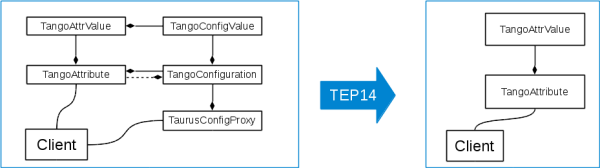

    Title: core refactoring (quantities and configuration)
    TEP: 14
    State: ACCEPTED
    Date: 2016-03-16
    Drivers: Carlos Pascual-Izarra <cpascual@cells.es>, Carlos Falcon-Torres <cfalcon@cells.es>
    URL: http://www.taurus-scada.org/tep?TEP14.md
    License: http://www.jclark.com/xml/copying.txt
    Abstract:
     This proposal picks the tango.core refactoring from TEP3 and takes it a 
     step further. While TEP3 eliminates the PyTango module dependencies, 
     this TEP aims to get rid some of the most evident "tangoisms" still left 
     in the code by TEP3. Among other things it implements support for 
     Quantities and eliminates the attribute configuration classes 

Introduction & motivation
=========================

This TEP is a spin-off of [TEP3][]. It proposes a refactoring of taurus.core to get rid of some tango-centric implementation details that were left by [TEP3][]. The objective is to obtain a cleaner and more scheme-agnostic API for creation of new schemes. Several inter-related aspects of the taurus core are refactored:

- the  xxxConfiguration classes are merged into xxxAttribute
- The AttributeValue members and their types are more strictly defined and unified among schemes (e.g. physical values are expected to be Quantity objects)
- Several tango-centric enumerations are substituted by scheme-agnostic ones 
- A new API for  "model fragments" replaces the "configuration" API, extending its scope
- A new API for deprecation messages is implemented

An explicit objective of this TEP is to **provide as much backwards-compatibility as possible**. Some of the changes unavoidably break the backwards compatibility, but, whenever it is possible, a compatibility API is left in place which uses the new deprecation mechanisms to inform the developers of the new recommended alternative.

Merge of xxxConfiguration into xxxAttribute
============================================

One of the main changes of this TEP involves the removal of the xxxConfiguration,
and xxxConfigurationValue classes, and their role being taken by xxxAttribute.

The resulting class relationships is then simplified, as seen in the following figure:

From the point of view of application code (e.g. widgets), this implies that:

- where a xxxConfiguration was used/received, a xxxAttribute will be used/received instead. This xxxAttribute now provides the configuration API too.
- The Value associated to Configuration events will now be a xxxAttrValue. In the case of Tango, the TangoAttrValue provides backwards-compatibility (though deprecated) by allowing transparent 
access to the configuration API implemented in the TangoAttribute

Scheme-agnostic API for xxxAttribute and xxxAttributeValue
==============================

Previous to this proposal, the API for xxxAttribute and xxxAttributeValue (as well the configuration API) was not defined, and the tango scheme was used as a loose reference by other schemes. 

This proposal defines, via the TaurusAttributeValue and TaurusAttribute classes, a base API for all schemes to use, so that it can be relied upon when writing scheme-agnostic code.

Allowed data types
-------------------------

Apart of defining standard members for common concepts (e.g. "range" for the `min,max` tuple in which a value can vary), the types allowed for these members are also restricted by this TEP:

  -  all members of xxxAttribute and xxxAttributeValue representing physical magnitudes  must use Quantity objects (from the `taurus.external.pint` module). Note that Quantity objects allow for both scalar and non-scalar magnitudes to be represented. See table below.
  - members representing strings, booleans or bytes, must use the standard python types (including numpy types). See table below
  - members containg enumerations should use Enum or IntEnum `from taurus.external.enum` (preferred) or Enumeration from (`taurus.core.util.enumeration`)
  - as a general rule for other cases, only standard python types (inc. numpy, Quantitys and Enum) or taurus-defined scheme-agnostic types should be used by members of the common API

Schemes must use encode/decode methods to ensure that the common API is respected even if the scheme internally uses scheme-specific types. Of course, it is allowed for a scheme to extend the API with its own scheme-specific members which would not be subject to the rules defined here, but it should be kept in mind that those extensions will not be usable by scheme-agnostic code.

The following table summarizes the allowed types for the read/write values, limits, etc. depending on the type and format of the attribute:

DataType           | _0D         | _1D                   | _2D
------------------- | ------------ | ------------------- | ---------------------- 
Boolean            | bool         | `ndarray<bool>` | `ndarray<bool>` 
Integer, Float    | Quantity  | Quantity            | Quantity
String                | str           | `seq<str>`          | `seq<seq<str>>`
Bytes                 | bytes      |                          |

Some important remarks:

- units is no longer a common member of the TaurusAttribute. Each physical value, being represented as a Quantity object, has its own units (e.g. the rvalue, wvalue or the range values units are not necessarily identical, although they should be compatible among them)
- The use of Quantity objects blurs the difference between integer and float numbers because unit transformations may transform a quantity whose magnitude initially was an integer into a "float"-based quantity. But this is not essentially different from the implicit type conversion between int and float objects.
- while numpy arrays are the only allowed types for representing non-scalar booleans (and the same for integers and float within Quantities), we do **not** require numpy arrays for arrays of strings because `numpy.ndarray` imposes fixed lengths of its items. Instead, for strings we recomend using (nested) lists of `str`.

Agnostic configuration attributes
-----------------------------------------

As explained before, the information previously available via the xxxConfiguration API is now part of the xxxAttribute scheme-agnostic API. However in order to avoid using tango-centric enumerations/concepts the new API relies on newly defined enumerations and/or standard python objects for some information that was previously encoded with tango-centric types:

  - Instead of using `PyTango.AttrDataFormat`, the dimensionality of a given attribute is now described by the `taurus.DataFormat` enumeration, which currently defines `_0D`, `_1D`, and `_2D`, corresponding to the scalars, spectrum and image types of Tango, respectively. More formats may eventually be added if support for them is introduced in taurus.
  - Instead of using `PyTango.CmdArgType`, the data type of a given attribute is now described by the `taurus.DataType` enumeration, which currently defines  `Boolean`, `Integer`, `Float`, `String` and `Bytes` types (plus some other deprecated types as well as a type for opaque objects). A map of Tango to Taurus data types can be found in `taurus.core.tango.util.tango_taurus.FROM_TANGO_TO_TAURUS_TYPE`
  - The quality of a given xxxAttribute value is now described by the `taurus.AttrQuality` enumeration instead of the `PyTango.AttrQuality`
  - The error status is now described by either a None (for no errors) or a python Exception object in case of errors.
  - The access mode for an attribute (previously described with `PyTango.AttrWriteType`)  is now described by a boolean stored in the `writable` attribute/property of a xxxAttribute.
  - The timestamp is now stored as a TaurusTimeVal.

Scheme-agnostic API for xxxDevice
===========================

Just as for xxxAttribute, this proposal defines, via the TaurusDevice class, a base API for all schemes to use, so that it can be relied upon when writing scheme-agnostic code.

Previous to this proposal the xxxDevice objects were heavily influenced by the TangoDevice implementation. In particular the concept of a "device state" was linked to the tango-centric assumption that all xxxDevices had at least one associated xxxAttribute called "state", which reflected the device's state using the `PyTango.DevState`. Also, other tango-influenced enumerations were used by Taurus in relation to the state of the connection state/health of a device (`TaurusDevSWState`,   `TaurusDevSWHealth`)

This TEP avoids those tango-specific assumptions and defines a simpler (albeit less informative) API for dealing with the device state: now "state" is an attribute/property of the xxxDevice which uses the `taurus.TaurusDevState` enumeration to describe the device state in a scheme-agnostic way.

Note that each scheme is still alowed to provide its own specific API to handle richer state information but, of course, it will not be used by scheme-agnostic code (e.g., in a tango-specific context one could still get PyTango.DevState info by using `TangoDevice.stateObj.read()`).

Note that this change is one of the possible sources of unavoidable backwards incompatibilities introduced by this TEP.

Scheme-agnostic API for xxxAuthority
============================

The concept of "Authority" models type was already introduced in [TEP3][] to generalise the tango-centric "Database". This TEP defines a base API for xxxAuthority via the TaurusAuthority base class. This is the api that scheme-agnostic code can use for dealing with Authority models. 

Interpretation of fragments in model names
==========================

Since [TEP3][], the concept of "URI fragments" was introduced in the model names (a model name may contain a "#" symbol followed by a fragment name). In [TEP3][] only a limited use was done of this syntax. This proposal generalises it: 

- The model name (i.e., without the fragment name) is an identifier for a model object
- The fragment name is an identifier of a member of the model object. 

For example, "tango:a/b/c/d" refers to the TangoAttribute object (which is a subclass of TaurusModel) representing the "a/b/c/d" Tango attribute, and  "tango:a/b/c/d#label" refers to the object's "label" attribute.

It is important to note that **the  fragment name is not a part of the model name**. In the Model-View-Controller pattern used in Taurus, the fragment name is only known by the view/controller parts, but not by the model.

Certain fragment names may be reserved in some or all model types to provide a common scheme-agnostic API (e.g., widgets will expect that suffixing "#label" to any attribute name will be interpreted as a reference to the "label" of the attribute).

Other fragment names may be used to access scheme-specific members of the given model object. For example, this will allow TaurusCommand button (which is for now actually a Tango-specific widget) to refer to methods of the TangoDevice object which execute Tango commands (it is easy to imagine that this could open the door to supporting the concept of "Taurus commands" in general).

Currently, the list of reserved fragment names corresponds to the public properties/attributes of the base model classes (TaurusAttribute, TaurusDevice, TaurusFactory):

- For all models
    - name 
    - fullname 
    - description
- For TaurusAttribute
    - label
    - writable
    - data_format
    - type
    - range
    - warnings 
    - alarms
    - rvalue (uses the last value)
    - wvalue (uses the last value)
    - time (uses the last value)
    - quality (uses the last value)
- For TaurusDevice
    - state
- For TaurusAuthority

Finally, note that dot-syntax is supported by the fragment mechanism: e.g. on can refer to the units of the read value of the "a/b/c/d" tango attribute using "tango:a/b/c/d#rvalue.units"

Summary of API changes
===============

The deprecations introduced by this proposal can be identified in the code by the use of the `@tep14_deprecation` decorator and the calls to the `deprecated` function with the `rel='tep14'` argument.

The [Taurus4-API_changes](http://taurus-scada.org/devel/taurus3to4.html#api-changes) document is an attempt to explicitly list all the changes (it is not considered part of this TEP because it is likely to be modified to include more comments or missing changes)

Links to more details and discussions
======================================

The proposed implementation was done for the most part internally at the ALBA synchrotron and therefore most of the discussion took place either offline or with internal mechanisms for which unfortunately no external access is available.

Some discussions/announcements about TEP14 were held on the tauruslib-devel and taurus-user mailing list:

- https://sourceforge.net/p/tauruslib/taurus-devel/message/34641275/
- https://sourceforge.net/p/tauruslib/taurus-devel/message/34643400/

Implementation and Follow on
===================

A proposal of implementation was pushed to the `taurus4-preview` branch at the official repository.

The mentioned branch also includes changes belonging to [TEP3][], since that is the starting implementation point for TEP14. It also includes the minimal necessary changes in Taurus widgets in order for them to work with the changes of the core due to TEP14 (note that these changes in widgets are technically out of the scope of TEP14, but they are convenient in order to properly evaluate the implementation proposal).

Apart of the minimal changes just mentioned, the taurus widgets require further changes in order to take advantage of the new features provided by this TEP (e.g., plots currently use only the magnitude information from their model values, when they should use the units info as well). Another TEP (or feature-request-driven development) should be started for that.

License
==================

The following copyright statement and license apply to SEP3 (this
document).

Copyright (c) 2015 CELLS / ALBA Synchrotron, Bellaterra, Spain

Permission is hereby granted, free of charge, to any person obtaining
a copy of this software and associated documentation files (the
"Software"), to deal in the Software without restriction, including
without limitation the rights to use, copy, modify, merge, publish,
distribute, sublicense, and/or sell copies of the Software, and to
permit persons to whom the Software is furnished to do so, subject to
the following conditions:

The above copyright notice and this permission notice shall be included
in all copies or substantial portions of the Software.

THE SOFTWARE IS PROVIDED "AS IS", WITHOUT WARRANTY OF ANY KIND,
EXPRESS OR IMPLIED, INCLUDING BUT NOT LIMITED TO THE WARRANTIES OF
MERCHANTABILITY, FITNESS FOR A PARTICULAR PURPOSE AND NONINFRINGEMENT.
IN NO EVENT SHALL THE AUTHORS OR COPYRIGHT HOLDERS BE LIABLE FOR ANY
CLAIM, DAMAGES OR OTHER LIABILITY, WHETHER IN AN ACTION OF CONTRACT,
TORT OR OTHERWISE, ARISING FROM, OUT OF OR IN CONNECTION WITH THE
SOFTWARE OR THE USE OR OTHER DEALINGS IN THE SOFTWARE.

Changes
========

2015-04-28
[cpascual](https://github.com/cpascual/) First draft based on parts moved from [TEP3][] and previous discussions with [tiagocoutinho](http://sf.net/u/tiagocoutinho/), [cfalcon](https://sf.net/u/cmft/) and [zreszela](http://sf.net/u/zreszela/)

2015-11-23
[cpascual](https://github.com/cpascual/) Implementation proposal uploaded to taurus4-preview branch of official repo

2016-03-11
[cpascual](https://github.com/cpascual/) Completed missing sections, rewritted existing ones and passed to CANDIDATE

2016-03-16
[cpascual](https://github.com/cpascual/) Passing to  ACCEPTED

2016-11-16
[mrosanes](https://github.com/sagiss/) Adapt TEP format and URL according TEP16

2019-04-03
[cpascual](https://github.com/cpascual/) Update outdated sf.net links

[TEP3]: http://www.taurus-scada.org/tep?TEP3.md
