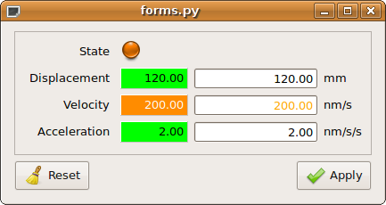

.. _introduction:

============
Introduction
============

Taurus was originally conceived as a library for connecting client side
applications (CLIs and GUIs) to Tango_ device servers. Since v4.0
the Taurus core became control-system agnostic, and it supports other control
systems (such as EPICS_) and data sources.

.. note:: due to its Tango origin, this documentation will tend to use many
          Tango-related examples. We intend to gradually introduce more 
          non-Tango examples

Taurus was developed within the Sardana_ project, but since it has been found 
useful for other projects not related to Sardana, it has been 
moved to a separate project (although both projects are kept in sync and share 
most of their developers).

Taurus uses the Model-View-Controller (MVC) pattern to build interfaces. 

The :mod:`taurus.core` module uses plugins (known as schemes) to provide TaurusModel 
objects that abstract the interactions with specific sources of data and/or 
control objects. Some schemes are already implemented for accessing control system 
libraries (the "tango" and "epics" schemes) as well as for data-processing via a 
Python interpreter (the "evaluation" scheme). see the :ref:`taurus-core-tutorial`
for more information on the taurus core.

The Taurus view and controller components are typically implemented as PyQt_ based
GUIs, but it may also consist on command line interfaces such as Sardana's spock.

The :mod:`taurus.qt` module provides a set of basic widgets (labels, LEDs, editors, 
forms, plots, tables, buttons, synoptics,...) that extend related Qt widgets with 
the capability of attaching to Taurus core models in order to display and/or change 
their data in pre-defined ways. For example, a TaurusPlot widget will display a curve
for each attribute model to which it is attached if its value is a one-dimensional 
numerical array. Similarly, a TaurusForm widget will allow the user to interact with 
the data represented by its attached models. The actual association of a view (widget) 
with a model is done by providing the model name to the widget. 

The following is an example on how to create a widget that allows to interact with
four attributes (state, position, velocity, acceleration) of a Tango device 
(`motor/icepap/01`)::

    import sys
    from taurus.qt.qtgui.panel import TaurusForm
    from taurus.qt.qtgui.application import TaurusApplication
    
    app = TaurusApplication(sys.argv, cmd_line_parser=None)
    
    attrs = [ 'state', 'position', 'velocity', 'acceleration' ]
    model = [ 'motor/icepap/01/%s' % attr for attr in attrs ]
    
    w = TaurusForm()
    w.model = model
    w.show()
    sys.exit(app.exec_())

  
  The GUI resulting from the above code

The above example can even be achieved even without typing any code::

    % cd taurus/qt/qtgui/panel
    % taurus form motor/icepap/01/state motor/icepap/01/position motor/icepap/01/velocity
  
For many more examples, See the :ref:`examples` page.

Taurus is a pure-python module, but it makes heavy use of PyTango_, numpy_,
PyQt_, etc. to provide good performance even when 
large amounts of data are involved.

.. _Sardana: http://www.sardana-controls.org/
.. _Tango: http://www.tango-controls.org/
.. _Epics: http://www.aps.anl.gov/epics/
.. _PyTango: http://packages.python.org/PyTango/
.. _QTango: http://www.tango-controls.org/download/index_html#qtango3
.. _`PyTango installation steps`: http://packages.python.org/PyTango/start.html#getting-started
.. _Qt: http://qt.nokia.com/products/
.. _PyQt: http://www.riverbankcomputing.co.uk/software/pyqt/
.. _PyQwt: http://pyqwt.sourceforge.net/
.. _IPython: http://ipython.scipy.org/
.. _ATK: http://www.tango-controls.org/Documents/gui/atk/tango-application-toolkit
.. _Qub: http://www.blissgarden.org/projects/qub/
.. _numpy: http://numpy.scipy.org/
.. _SPEC: http://www.certif.com/
.. _EPICS: http://www.aps.anl.gov/epics/
