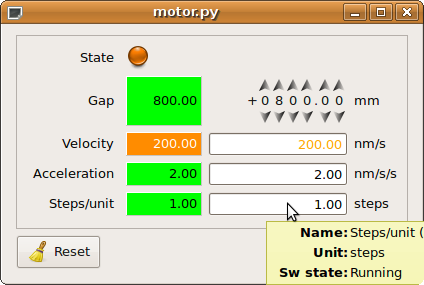

.. Tau documentation master file, created by
   sphinx-quickstart on Thu Dec 10 10:39:03 2009.
   You can adapt this file completely to your liking, but it should at least
   contain the root `toctree` directive.

Welcome to Taurus's |version| documentation!
=============================================

    |image1| |image2| |image3|

.. sidebar:: Latest news

    2014-02-14
        Taurus 3.2.0 released!

    2013-07-25
        Taurus 3.1.0 released!

    2012-04-24
        Taurus 3.0.0 released!

    2011-03-23
        Taurus 2.1.1 released!

Taurus is a python framework for both CLI and GUI tango applications. It is
build on top of PyTango_ and PyQt_. Taurus stands for TAngo User interface 'R' US.

Taurus was originally known as Tau. Since version 2 the name was
changed to Taurus.

An :ref:`introduction` guide will help you getting started with the basic taurus
concepts.

For sampling, see the :ref:`screenshots` and :ref:`examples` directory.

.. |image2| image::  _static/taurusplot03.png
    :align: middle
    :height: 180
    
.. |image3| image::  _static/taurus_tree01.png
    :align: middle
    :height: 180

.. toctree::
    :hidden:

    contents

:Last Update: |today|

.. _Tango: http://www.tango-controls.org/
.. _PyTango: http://packages.python.org/PyTango/
.. _Qt: http://qt.nokia.com/products/
.. _PyQt: http://www.riverbankcomputing.co.uk/software/pyqt/
.. _IPython: http://ipython.scipy.org/
.. _ATK: http://www.tango-controls.org/Documents/gui/atk/tango-application-toolkit
